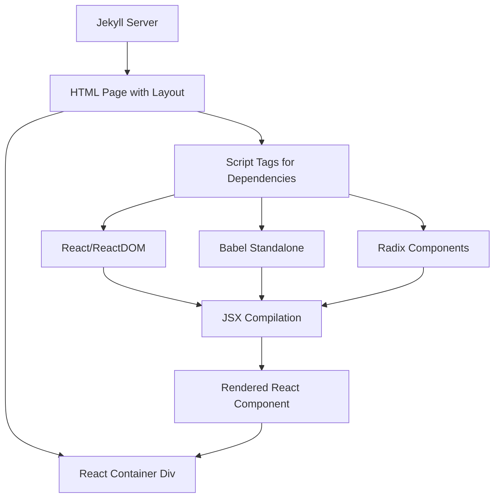

# Design Document

## Overview

This design implements client-side React rendering with Radix + Tailwind components for a Jekyll-based website. The solution uses browser-based JSX compilation via Babel to avoid complex build processes while maintaining the existing Jekyll architecture. The implementation will be demonstrated on the rfc6902 page with a "Hello World" Radix component.

## Architecture

### High-Level Architecture

The solution follows a hybrid approach where Jekyll handles server-side rendering of the page structure, and React handles client-side rendering of interactive components within designated containers.



### Component Integration Strategy

1. **Jekyll Layout Integration**: Use existing Jekyll layouts with minimal modifications
2. **Script Loading**: Load React, ReactDOM, Babel, and Radix components via CDN
3. **JSX Compilation**: Use Babel standalone to compile JSX in the browser
4. **Component Rendering**: Render React components into designated DOM containers
5. **Styling Integration**: Leverage existing Tailwind CSS classes for consistent styling

## Components and Interfaces

### Core Dependencies

1. **React & ReactDOM**: Core React libraries loaded via CDN
   - React 18.x for modern features and performance
   - ReactDOM for DOM manipulation

2. **Babel Standalone**: Client-side JSX compilation
   - Babel 7.x standalone build
   - Configured for JSX and modern JavaScript features

3. **Radix UI Components**: Unstyled, accessible components
   - Radix UI primitives for common UI patterns
   - Tailwind CSS for styling and theming
   - Existing site Tailwind configuration for consistency

### Page Structure

```html
<!-- Jekyll front matter and layout -->
---
layout: default
title: "Page Title"
---

<!-- React container -->
<div id="react-root"></div>

<!-- Import map for dependencies -->
<script type="importmap">
{
  "imports": {
    "react": "https://cdn.jsdelivr.net/npm/react@18/+esm",
    "react-dom/client": "https://cdn.jsdelivr.net/npm/react-dom@18/+esm",
    "@radix-ui/react-dialog": "https://cdn.jsdelivr.net/npm/@radix-ui/react-dialog@latest/+esm",
    "@radix-ui/react-button": "https://cdn.jsdelivr.net/npm/@radix-ui/react-button@latest/+esm"
  }
}
</script>

<!-- Babel for JSX compilation -->
<script src="https://cdn.jsdelivr.net/npm/@babel/standalone@7/babel.min.js"></script>

<!-- JSX Component -->
<script type="text/babel">
  // React component code here
</script>
```

### Radix Component Selection

For the initial "Hello World" implementation, we'll use:
- **Button**: Interactive element with proper accessibility
- **Dialog**: Modal component for demonstration
- **Container**: Basic layout using Tailwind classes
- **Typography**: Text elements styled with Tailwind

### React Component Structure

```jsx
import React, { useState } from 'react';
import { createRoot } from 'react-dom/client';
import * as Dialog from '@radix-ui/react-dialog';
import * as Button from '@radix-ui/react-button';

const HelloWorldApp = () => {
  const [open, setOpen] = useState(false);
  
  return (
    <div className="p-6 max-w-md mx-auto bg-white rounded-xl shadow-lg">
      <h1 className="text-2xl font-bold text-gray-900 mb-4">
        Hello World with Radix + Tailwind
      </h1>
      <p className="text-gray-600 mb-4">
        This is a React component using Radix UI primitives styled with Tailwind CSS!
      </p>
      
      <Button.Root 
        className="bg-blue-500 hover:bg-blue-700 text-white font-bold py-2 px-4 rounded"
        onClick={() => setOpen(true)}
      >
        Open Dialog
      </Button.Root>
      
      <Dialog.Root open={open} onOpenChange={setOpen}>
        <Dialog.Portal>
          <Dialog.Overlay className="fixed inset-0 bg-black bg-opacity-50" />
          <Dialog.Content className="fixed top-1/2 left-1/2 transform -translate-x-1/2 -translate-y-1/2 bg-white p-6 rounded-lg shadow-xl max-w-sm mx-auto">
            <Dialog.Title className="text-lg font-semibold mb-2">
              Hello from Radix Dialog!
            </Dialog.Title>
            <p className="text-gray-600 mb-4">
              This dialog is built with Radix UI and styled with Tailwind CSS.
            </p>
            <Dialog.Close 
              className="bg-gray-500 hover:bg-gray-700 text-white font-bold py-2 px-4 rounded"
            >
              Close
            </Dialog.Close>
          </Dialog.Content>
        </Dialog.Portal>
      </Dialog.Root>
    </div>
  );
};

// Render the component
const container = document.getElementById('react-root');
const root = createRoot(container);
root.render(<HelloWorldApp />);
```

## Data Models

### Configuration Object

```javascript
const ReactConfig = {
  containerId: 'react-root',
  babelPresets: ['react', 'env'],
  cloudscapeTheme: 'default'
};
```

### Component Props Interface

```javascript
// HelloWorld component props
const HelloWorldProps = {
  title: String,
  message: String,
  showButton: Boolean
};
```

## Error Handling

### Script Loading Errors

1. **Dependency Loading**: Implement fallback mechanisms for CDN failures
2. **Babel Compilation**: Handle JSX syntax errors gracefully
3. **Radix Loading**: Verify Radix components are available before rendering


### Graceful Degradation

- If React fails to load, show a fallback message

## Testing Strategy

### Manual Testing Approach

1. **Cross-Browser Testing**: Test in Chrome, Firefox, Safari, and Edge
2. **Mobile Responsiveness**: Verify Radix components work on mobile devices
3. **Performance Testing**: Monitor page load times with additional dependencies
4. **Accessibility Testing**: Ensure Radix components maintain accessibility standards

### Test Scenarios

1. **Happy Path**: All dependencies load successfully, component renders correctly
2. **Network Failures**: CDN unavailable, graceful degradation occurs
3. **JavaScript Disabled**: Page remains functional without React components
4. **Slow Connections**: Progressive loading doesn't block page rendering

### Validation Checklist

- [ ] React component renders in designated container
- [ ] Radix components render with Tailwind styling correctly
- [ ] No conflicts with existing Jekyll/Tailwind styles
- [ ] Page maintains Jekyll layout structure
- [ ] Error handling works for common failure scenarios
- [ ] Performance impact is acceptable
- [ ] Mobile responsiveness is maintained

## Design Rationales

### Key Design Decisions

1. **Radix UI over other component libraries**: Radix provides unstyled, accessible primitives that work perfectly with Tailwind CSS, maintaining consistency with the existing site design while ensuring accessibility standards.

2. **Client-side JSX compilation**: Using Babel standalone allows for immediate development without setting up a complex build process, keeping the Jekyll workflow intact while adding React capabilities.

3. **CDN-based dependency loading with import maps**: jsDelivr CDN provides reliable, cached delivery of dependencies while import maps enable clean ES module imports without requiring local package management or build steps.

4. **Tailwind CSS integration**: Leveraging the existing Tailwind setup ensures visual consistency across Jekyll and React components while avoiding style conflicts.

5. **Container-based rendering**: Using designated DOM containers allows React components to coexist with Jekyll's server-side rendered content without interference.

## Implementation Considerations

### CDN Selection

Use jsDelivr CDN for all dependencies for consistency and reliability:
- **React/ReactDOM**: `https://cdn.jsdelivr.net/npm/react@18/+esm`
- **Babel Standalone**: `https://cdn.jsdelivr.net/npm/@babel/standalone@7/babel.min.js`
- **Radix UI Components**: `https://cdn.jsdelivr.net/npm/@radix-ui/react-dialog@latest/+esm`

### Performance Optimization

1. **Lazy Loading**: Load React dependencies only on pages that need them
2. **Caching**: Leverage CDN caching for better performance
3. **Minification**: Use minified versions of all dependencies
4. **Preloading**: Consider preloading critical dependencies

### Style Integration

1. **CSS Isolation**: Ensure Radix styles don't conflict with Tailwind
2. **Theme Consistency**: Use Tailwind classes to maintain consistent site design
3. **Responsive Design**: Maintain existing responsive behavior with Tailwind utilities

### Future Extensibility

1. **Reusable Patterns**: Create templates for other pages
2. **Component Library**: Build custom components on top of Radix + Tailwind
3. **State Management**: Plan for more complex state needs in future
4. **Build Process**: Consider migration to proper build process if complexity grows